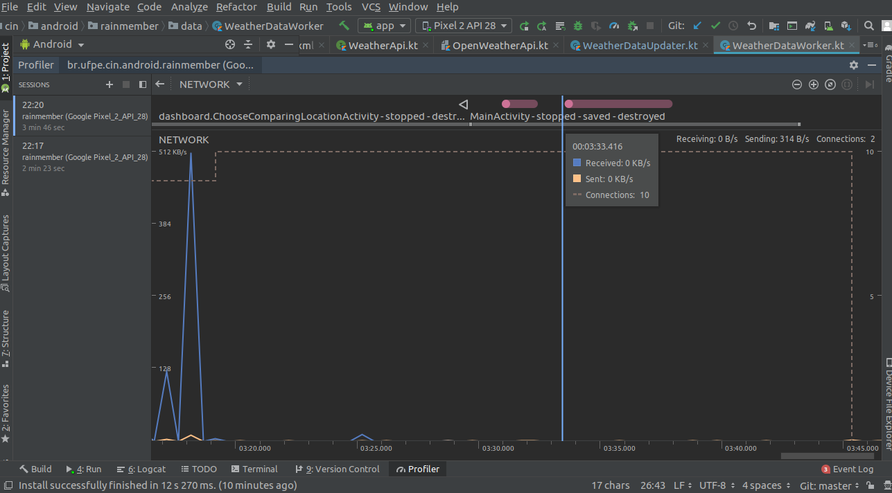

# Consumo de Rede

## Escolha do cliente HTTP
Escolhemos o cliente HTTP *OkHttp* para fazer a comunicação com as APIs que fornecem os dados de clima, essa escolha foi feita pela sua facilidade de configuração e uso.

## Cache de Dados
Como dito também na seção de bateria, fizemos cache dos dados, fazendo com que os dados das APIs seja requisitados em um worker rodando em background, invés de toda vez que o usuário abrir o aplicativo, além disso as cidades usadas no componente de comparação de cidades são armazenadas em disco, fazendo com que o esses dados só sejam baixados uma única vez.

## Network Profiler
Rodamos o network profiler e tivemos o seguinte resultado:

Concluimos que o resultado foi bom, pois a atividade mais custosa só precisa ser executada uma vez no fluxo do aplicativo, com todos os outros momentos consumindo quase 0 de rede, exceto nos momentos que são requsitados dados na API, em que o consumo é aumentado minimamente.